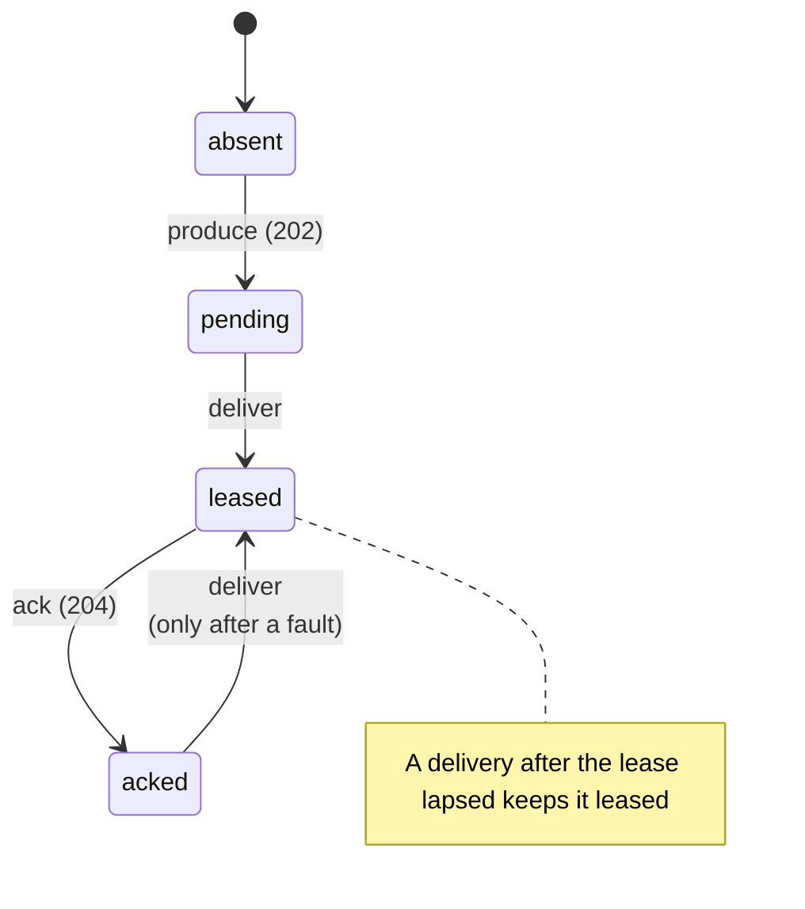

# Linearizability: the contract, and how it is tested

Learn what it means for Narad's delivery contract to linearize, which tests check it, and what those tests cannot catch.

!!! abstract "In short"
    - Each message moves through four states on each path it is delivered on: absent, pending, leased and acked. A history of produces, deliveries and acks is correct when some order of it, consistent with real time, follows those states.
    - A message delivered again after a confirmed ack is allowed only where a fault explains it: a broker that crashed, a machine that lost power, or a partition that moved.
    - Every pull request runs a three-node cluster through a load run and a run with node restarts. Both fail on a lost message, a message the run never produced, or one on the wrong topic.
    - Those runs check outcomes, not orderings, and inject restarts only. The limits are listed below.

Narad promises [at-least-once](../reference/glossary.md#at-least-once) delivery. A message that comes back after it was acked is *permitted*, so a counter that reports one has told you nothing you can act on. What you need to know is why it came back: because a broker was being killed at that moment, or for no reason anyone has written down. The first is the contract working. The second is a bug that has not been found yet.

## The property {#property}

The unit is a **(message, path)** pair, not a message. A message produced to a topic with [fan-out children](../reference/glossary.md#fan-out-child) is a separate delivery obligation on the parent and on every child, and each succeeds or fails on its own.

Each pair is a small state machine:

A history of concurrent operations is **linearizable** against this model when its operations can be put in one order that respects real time (an operation that returned before another began comes first) and walks every pair along these transitions only. Operations that overlap in time may go in either order, so a history is wrong only when *no* order explains it.

Some responses do not tell the client what happened, and a judgement of a history has to leave them out rather than guess:

| Situation | What it tells the client |
|---|---|
| Produce returned `202` | The broker holds the message |
| Produce returned `429` or `503` | The broker refused it. Delivering it later is a violation |
| Produce request errored | Ambiguous. It *may* exist, so a later delivery is legal and a missing one is not loss |
| Ack returned `204` | The lease was live and the message is done |
| Ack returned `410` | Ambiguous. A lapsed lease and an ack whose response was lost look the same |
| Ack request errored | Ambiguous. It may or may not have landed |

### Redelivery after an ack {#redelivery-after-ack}

Acks are persisted in batches: written to the page cache every 100 ms, and synced to disk once per durability interval (`storage.consumer_offset_commit_interval_ms`, 1 s by default). A broker process that dies with a batch still in memory comes back having forgotten those acks, and delivers those messages again. A machine that loses power can also lose what was in the page cache, up to about the durability interval of acks. A partition moving to a new owner can do the same for acks that landed during the copy. The [delivery contract](delivery-contract.md#at-least-once) lists all of these; they are the direct cost of not paying for a synchronous disk write per ack.

Outside those cases, a message whose ack was confirmed is not delivered again.

## How Narad is tested against it {#how-tested}

Every pull request runs two cluster suites in CI, next to the unit and e2e tests. Each starts three nodes on loopback with security on, and drives them with the load driver in `tests/integration`:

- **Cluster integration** (`make local-cluster-e2e`) produces a known set of messages, then consumes and acks all of it, with nothing broken. It fails on a message it never produced, a message on the wrong topic or with the wrong sequence, any message delivered twice, and any message never delivered.
- **Chaos** (`make local-cluster-chaos`) does the same while a script stops a random node every few seconds (`SIGTERM`, then `SIGKILL` if it has not exited within 10 seconds) and starts it again. Redeliveries are expected here, and counted. It fails on a message it never produced or one on the wrong topic, and unless every message is acked before the run's timeout.

Two more checks run by hand, not in CI:

- **Steady mode** (`go run ./tests/integration --mode steady`) runs producers and consumers at the same time for a fixed duration. It fails on a message it never produced, a message delivered again after its ack was confirmed (`--fatal-dup-after-ack`, on by default; turn it off for runs that restart brokers), two acks of one stored copy that both answered `204`, which means two consumers held a live lease at once (`--fatal-dup-before-ack`), and messages still unacked when the drain window closes.
- **Scripted cluster scenarios** in `tests/cluster` kill and restart nodes under load and require every message to be accounted for. They take minutes, so they sit behind the `cluster` build tag: `go test -tags cluster -count=1 -timeout 30m ./tests/cluster/...`.

From September to October 2026 the repository also held a checker that recorded every operation of a nightly run with killed and partitioned nodes, and searched for an order that explained the history. It is no longer part of the repository or its CI, and nothing on this page depends on it.

## What the tests cannot catch {#limits}

A test is only worth what its limits are honest about.

- **Outcomes, not orderings.** The driver judges each delivery against its own record of what it has produced and acked so far. It does not search for an order of concurrent operations, so a redelivery that overlapped its own ack in time counts as one after the ack.
- **Redeliveries under faults are counted, not explained.** The chaos run passes with any number of them as long as every message is acked. Nothing ties a redelivery to the restart that caused it.
- **Restarts only.** CI stops and starts processes. It does not cut nodes off from their peers, lose power or destroy a disk.
- **Double leases are caught only in steady mode**, which CI does not run.
- **Ordering is not checked**, because Narad does not promise it (see [Ordering](delivery-contract.md#ordering)).
- **One host, one clock.** Three brokers on loopback are not three machines on a network.
- **Small runs.** A CI run moves about a hundred messages, so it catches a broken path rather than a rare race.
- **A green run is evidence, not proof.** It says that this workload, on this hardware, for these minutes, under these faults, produced nothing the driver could flag.

## Next steps

- [Delivery contract](delivery-contract.md#failure-matrix): what each failure does to your messages.
- [Produce path](produce-path.md): how a message becomes durable, the first step the contract relies on.
- [Cluster lifecycle](cluster-lifecycle.md#chaos-results): the force-kill scenarios run under the earlier soak workload.
