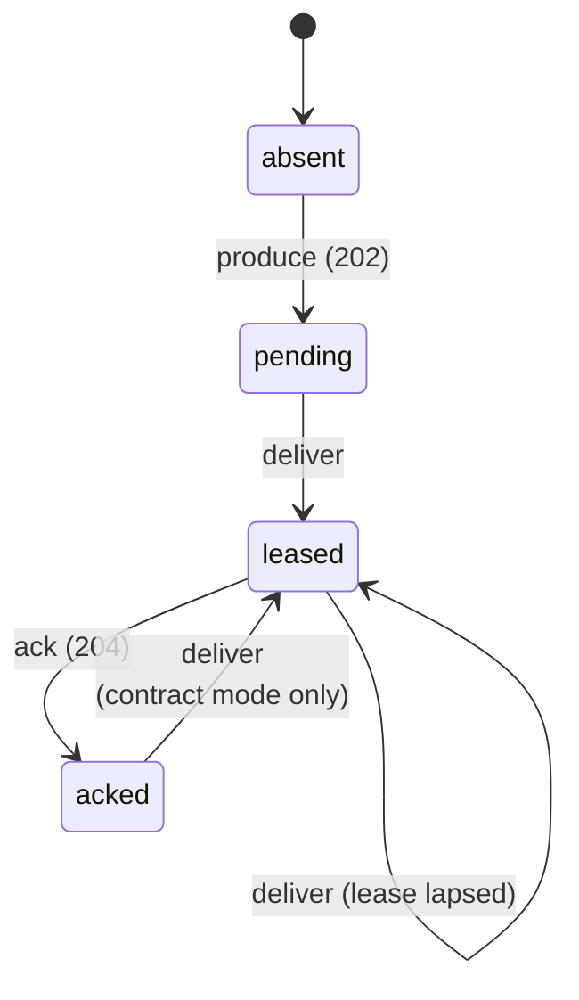

# Linearizability check: the contract, tested nightly

Learn how a nightly run checks Narad's delivery contract: what it records, how a model judges the history, and what it cannot catch.

!!! abstract "In short"
    - Every night a three-node cluster runs under load while nodes are killed and cut off from their peers.
    - Every client operation is recorded with the interval it was in flight for, and the history is checked against a model of the [delivery contract](delivery-contract.md).
    - A message delivered again after a confirmed ack is allowed only inside a fault window. One that is not fails the run.
    - A second run injects no faults and fails on any redelivery after an ack at all.
    - A green run is evidence for one workload, not proof; the limits are listed below.

Narad's test suites answer "did anything break". This check answers a harder question: **is every anomaly accounted for?**

The distinction matters because Narad promises [at-least-once](../reference/glossary.md#at-least-once) delivery. A message that comes back after it was acked is *permitted*, so a counter that reports one has told you nothing you can act on. What you need to know is why it came back: because a broker was being killed or partitioned at that moment, or for no reason anyone has written down. The first is the contract working. The second is a bug that has not been found yet.

So a nightly job runs a three-node cluster under load, kills and partitions nodes underneath it, records every client operation with the interval it was in flight for, and checks the resulting history against a sequential specification of the contract. **An unexplained anomaly fails the run.**

## What gets recorded {#history}

The load driver writes a JSONL history when given `--history`: one line per operation, with the interval it was in flight for.

```json title="One history record (timestamps shortened)"
{
  "op": "produce",
  "msg": "run/orders/0001",
  "path": "orders",
  "call": 1726,
  "ret": 1741,
  "status": 202,
  "outcome": "ok"
}
```

A delivery and an ack of the same message follow as `deliver` and `ack` records, each with its own interval and status (`200` and `204`). The fault injector writes its fault windows to a second file, merged at check time. Timestamps are wall-clock nanoseconds, because two processes have to interleave their records on one scale.

Empty polls are not recorded. A consume that returned nothing is not an operation on any message, and recording every one of them made an earlier version of the history grow by hundreds of megabytes an hour.

The history is the evidence, not a by-product. It is published as a CI artifact for thirty days, so a verdict can be derived again later under a stricter model, or disputed, without repeating the run.

## The contract model {#model}

The unit is a **(message, path)** pair, not a message. A message produced to a topic with [fan-out children](../reference/glossary.md#fan-out-child) is a separate delivery obligation on the parent and on every child, and each succeeds or fails on its own. Partitioning the history on that pair also keeps the check cheap: each partition holds a handful of operations rather than the whole run.

The run **declares** its topology in the history's first record: for each topic, the paths a message produced to it is expected to arrive on. Declaring it, rather than inferring it from the deliveries that happened, is what lets a delivery on any other path be reported as a misroute. Inference cannot do that: a leaked delivery would make its own path legal simply by occurring, and the leak would look like an ordinary backlog on the real topic. A history with no declared topology is still checked, with that weakness, and nothing in it is reported as misrouted.

Each partition is a small state machine:



Operations the client cannot interpret are **dropped before they reach the model** rather than guessed at. This is what keeps the checker free of false positives:

| Situation | Treatment |
|---|---|
| Produce returned `202` | The broker holds it |
| Produce returned `429` or `503` | The broker refused it. Delivering it later is a violation |
| Produce request errored | Ambiguous. It *may* exist, so a later delivery is legal and a missing one is not counted as loss |
| Ack returned `204` | The lease was live and the message is done |
| Ack returned `410` | Excluded. A lapsed lease and an ack whose response was lost look the same |
| Ack request errored | Excluded. It may or may not have landed |

[Porcupine](https://github.com/anishathalye/porcupine) searches for a valid ordering of each partition. That search is what makes a verdict trustworthy under concurrency: operations that overlap in real time may be ordered any way, so a finding stands only when *no* ordering explains the history.

## Verdicts {#verdicts}

| Verdict | Meaning | Exit |
|---|---|---|
| `OK` | Every partition linearized, and every post-ack redelivery sat inside a fault window | 0 |
| `OVERDUE` | No safety problem; a tail of messages was still undelivered or unacked when the run ended. Liveness, not a broken promise | 0 |
| `STALLED` | The same measurement past `--max-overdue`, where the honest reading is that delivery or acking is broken rather than slow | 1 |
| `ANOMALY` | A message was provably delivered again after a confirmed ack, with no fault to account for it | 1 |
| `VIOLATION` | A partition admits no valid ordering at all | 1 |
| `UNKNOWN` | The search did not finish in time, too few operations were recorded, or faults covered so much of the run that a clean result would mean nothing | 1 |

A `VIOLATION` also covers a **misroute**: a message handed to a consumer polling a topic it was never produced to. The report names the leak.

`UNKNOWN` on too little evidence matters more than it sounds. An empty history linearizes perfectly, so without a floor a driver that died on its first request would report "every partition linearized" and exit zero. The nightly sets the floor from its own expected volume.

The split between `OVERDUE` and `STALLED` exists for the same reason. A broker that answers `410` to every ack leaves every message unacked. Without a ceiling that reads as a backlog and exits zero: the worst ack-path failure there is, reported as a liveness footnote. `STALLED` is where that stops.

Fault coverage is enforced rather than only printed. Where coverage nears 100%, every redelivery falls inside some fault's grace and is explained by construction, so a green run proves nothing. Past `--max-fault-coverage` the checker says exactly that and exits non-zero, instead of leaving a person to notice the figure in a nightly log.

On a `VIOLATION` the checker names the first partition that could not linearize. `--visualize FILE` also writes Porcupine's interactive visualization. The nightly does not pass it: that flag puts Porcupine in verbose mode, which keeps every partial linearization and gives up its early stop at the first illegal partition. That is the wrong trade on a run that is already failing, and pure waste on the green runs that are the common case.

## Redelivery after an ack {#redelivery-after-ack}

This is the case the whole tool is built around, so here is exactly when it is expected.

Acks are persisted in batches: written to the page cache every 100 ms, and synced to disk once per durability interval (`storage.consumer_offset_commit_interval_ms`, 1 s by default). A broker process that dies with a batch still in memory comes back having forgotten those acks, and delivers those messages again. A machine that loses power can also lose what was in the page cache, up to about the durability interval of acks. A partition moving to a new owner can do the same for acks that landed during the copy. The [delivery contract](delivery-contract.md#at-least-once) lists all of these; they are the direct cost of not paying for a synchronous disk write per ack.

So the checker does not ask whether a redelivery happened. It asks whether each one sat inside a **fault window**: from the moment a fault began until it ended, plus a grace period. The grace defaults to the run's visibility timeout plus twenty seconds, because a broker that restarts releases the leases it held only when they expire, up to one visibility timeout later.

Choosing that grace is a real trade-off, and worth understanding before you trust a green run. Too short, and honest redeliveries look like anomalies. Too long, and a genuine bug hides inside a fault's shadow. Override it with `--grace` when a run's timing calls for it.

There is a sharper version of the same problem. If faults arrive closer together than the grace period, each window's grace swallows the next window's start. The windows merge into one unbroken interval, and "explained by a fault" quietly becomes "happened at all during the fault phase". So the injector spaces faults further apart than the grace, and **the report prints what fraction of the run sat inside a fault window**. Read that number before trusting a green result: the check can tell a bug from a fault only in the time the windows do not cover.

The **steady state** run of the nightly is the sharper claim. It injects no faults at all and runs under `--strict`, where any post-ack redelivery fails. That is what asserts a healthy Narad never delivers an acked message again: not "rarely", and not "within tolerance".

## What the check cannot catch {#limits}

A check is only worth what its limits are honest about.

- **Double leases are invisible.** The model has no clock, so "the lease expired" is not something it can observe, and a redelivery is always legal from the leased state. Two consumers holding the same message *at the same time* is a genuine fault this model accepts. The driver counts those separately as `dupBeforeAck`.
- **A redelivery overlapping its ack proves nothing.** Only a delivery that began strictly after an ack returned is counted, because anything else has an ordering in which the broker handed the message out before the ack landed.
- **Ordering is not checked**, because Narad does not promise it (see [Ordering](delivery-contract.md#ordering)).
- **A history with no declared topology cannot report misroutes.** Everything the driver writes declares one. A hand-made history need not, and then paths are inferred and a cross-topic leak reads as a backlog rather than a violation.
- **Explained is not the same as caused.** A redelivery inside a fault window is attributed to that fault on timing alone. Nothing proves the fault caused it, only that something was broken at the time.
- **One host, one clock.** Three brokers on loopback are not three machines on a network, and wall-clock timestamps assume the clock does not step. Records that return before they were called are clamped and counted in the report.
- **A green run is evidence, not proof.** It says that this workload, on this hardware, for these minutes, under these faults, produced nothing unexplained.

## Run the check yourself {#run-it}

**Unreleased:** in master, not in v3.0.1.

From a clone of the repository:

```bash
./scripts/linearizability-nightly.sh --duration 180 --drain 150
```

The script builds the broker, the load driver and the checker, starts three nodes on loopback, injects faults, and prints a verdict. Its options:

| Flag | What it does |
|---|---|
| `--no-faults` | A clean baseline run with nothing broken |
| `--strict` | Fail on *any* post-ack redelivery, not just unexplained ones |
| `--no-partition-faults` | Kills only |
| `--out DIR` | Where to leave the history, the faults and the verdict |
| `--duration N` | Seconds of load (default 180) |
| `--drain N` | Seconds the consumers get afterwards (default 150) |
| `--rate N` | Produces per second (default 300) |
| `--topics N` | Topics (default 3) |
| `--partitions N` | Partitions per topic (default 6) |
| `--visibility N` | Visibility timeout in seconds (default 5) |

The script rejects any other option. `--grace` and `--min-operations` belong to the checker, not the script: the script derives both from the run it just performed, the grace from `--visibility` and the evidence floor from `--duration` times `--rate`. Pass them yourself when you check a saved history again, as below. Set `NARAD_LINEARIZABILITY_VISUALIZE=1` to have the script ask the checker for a visualization.

Partition faults need `iptables` and passwordless `sudo`. Without them the script says so and injects kills only, which is the normal case on a developer laptop and on macOS.

### Check a saved history {#check-saved-history}

```bash
go run ./tests/linearizability --history history.jsonl --faults faults.jsonl
```

The nightly compresses its history before uploading it, and the checker reads plain JSONL, so unpack a run's artifact first:

```bash
gunzip history.jsonl.gz
go run ./tests/linearizability --history history.jsonl \
  --faults faults.jsonl --visualize violation.html
```

## Source layout {#layout}

| Path | What it is |
|---|---|
| `tests/linearizability/` | The checker: model, analysis, report |
| `tests/linearizability/history/` | The history format, shared with the driver |
| `tests/integration/` | The load driver that records histories |
| `scripts/linearizability-nightly.sh` | Cluster, faults and check in one run |
| `.github/workflows/linearizability.yml` | The nightly job |

## Next steps

- [Produce path](produce-path.md): how a message becomes durable, the first step the check relies on.
- [Delivery contract](delivery-contract.md#failure-matrix): the failure matrix the fault windows stand for.
