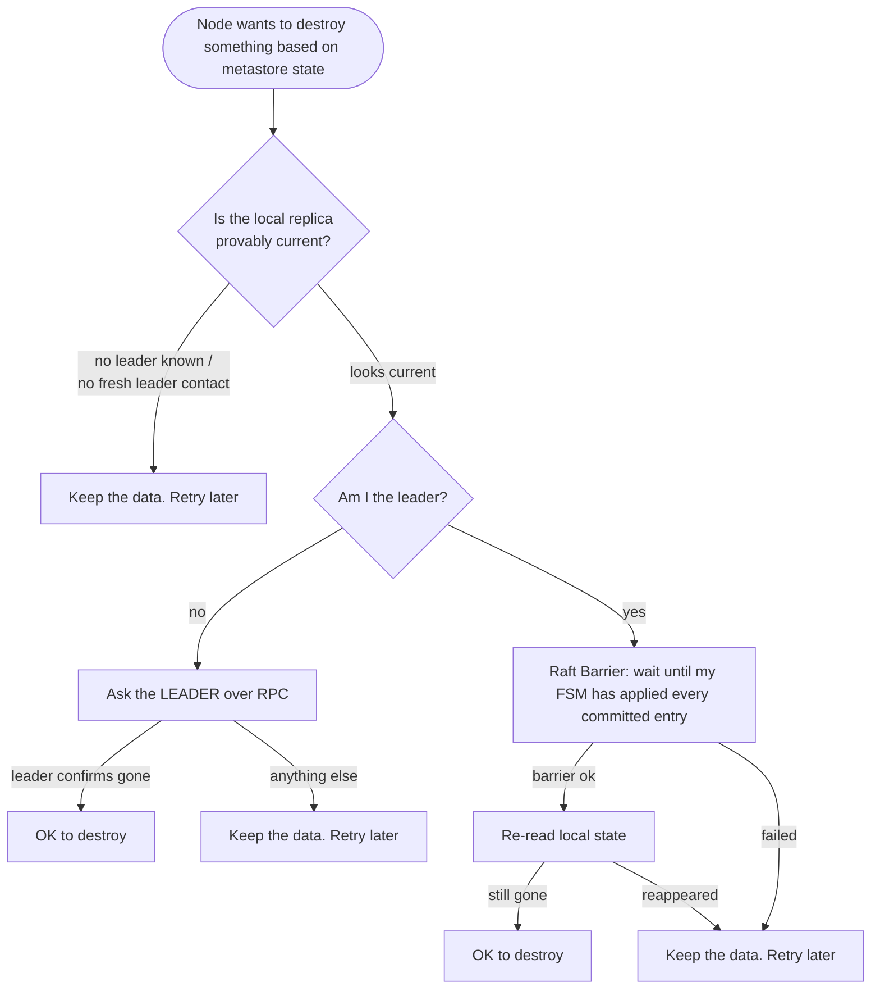

# Metastore and Raft

Learn how Narad keeps its metadata: a Raft-replicated state machine on every node, read locally, and the rules that keep stale replicas from destroying data.

The [metastore](../reference/glossary.md#metastore) holds everything that is not a message payload: topics, partition assignments, cluster members, users and grants, schemas, and fan-out links. Every node holds a full replica, kept in step by Raft.

## Metastore shape {#shape}

<figure class="nr-dia nr-dia--doc" id="fig-metastore-write-path">

--8<-- "diagrams/metastore-write-path.html"

<figcaption>Reads never leave the node. A write goes through the leader, and the node that forwarded it answers <code>201</code> only once its own FSM has applied it, so the next read there sees the write.</figcaption>
</figure>

- **Writes** (create a topic, register a member, attach a child) are Raft commands: forwarded to the leader, committed by a quorum, then applied to every node's state machine (FSM). A node that forwarded a write does not answer the client until its own FSM has applied it: it asks the leader for the index it applied and waits, for a bounded time, for its replica to reach it. So a read on the same node right after the response is never behind the write. Each command family bumps a per-domain **version counter**, so caches (such as topic lookups on the produce path) are invalidated precisely.
- **Reads** are local: every node answers topic lookups from its own bbolt replica, with no network hop. This is what makes request routing fast, and it is also the reason for the rules in [Stale replicas](#stale-replicas).
- The FSM persists in **bbolt**; Raft keeps its log in boltdb, plus periodic **snapshots** on disk. A restarting node restores FSM state from the latest snapshot, then replays the log tail.

## Metastore contents {#contents}

| Domain | Contents |
|---|---|
| Topics | name, partitions, retention, visibility, caps, schema, role (parent or child), fan-out links with attach epochs and delay |
| Assignments | partition to owner node, plus a move target while a rebalance or decommission moves it |
| Members | node ID, addresses, heartbeat, alive or dead |
| Users | usernames, bcrypt hashes, grants |
| Cluster | Raft voter configuration (managed by Raft itself) |

## Stale replicas {#stale-replicas}

Local reads are fast because they trust the local replica. But **a freshly restarted node's replica is restored from a snapshot that can be hours old**, and until it catches up, that node sees the past: topics that were deleted still exist, and topics created since do not. The node has no local way to know it is stale, since its own bookkeeping says "everything I know is applied."

<figure class="nr-dia nr-dia--doc" id="fig-metastore-log-vs-state">

--8<-- "diagrams/metastore-log-vs-state.html"

<figcaption>Winning an election proves the Raft log is complete, not that the FSM has applied it. Before acting on its own state, a leader runs a barrier and reads again.</figcaption>
</figure>

Chaos testing proved this is not theoretical: four separate data-loss bugs came from code trusting a stale local view (see [Cluster lifecycle](cluster-lifecycle.md#crash-recovery-bugs)). The defenses are now systematic:

Three primitives implement this:

- **`AppliedCaughtUp`** answers: "does this node have a leader, has it heard from it *recently*, and has it applied everything it knows to be committed?" The recency requirement matters. Right after a snapshot restore, a node's local indexes agree with each other trivially while being hours stale; only fresh contact with the leader makes the comparison meaningful.
- **Leader confirmation RPC.** Before deleting a topic directory, discarding a WAL record, or resetting a fan-out cursor, the node asks the leader "does this still exist?" Only a definite "no" allows destruction.
- **`Barrier`** is the subtle one. *Winning an election proves a node's Raft log is complete, not that its FSM has applied it.* A just-elected leader restored from an old snapshot legally serves stale reads while replay finishes. So "I am the leader, my state is the authority" is valid only after `raft.Barrier()` has blocked until the FSM is fully applied, and the state must be read again *after* the barrier.

## Leader and controller {#controller}

The Raft leader is also the **cluster controller**. It:

- assigns the partitions of new topics, round-robin over live members. A fan-out child is the exception: its partition p deliberately skips the owner of the parent's partition p (`metastore.ChildAwareOwner`), so a [replica child](../reference/glossary.md#replica-child)'s copy is placed on a different disk from the original;
- marks members dead when their heartbeats stop for 30 s;
- seeds the root admin.

Leadership transfer on graceful shutdown makes planned restarts nearly seamless (about 150 ms of failover); failover after a crash takes an election timeout (about 1 s).

A dead node's partitions are **not reassigned**, because their data lives only on that node's disk. The cluster waits for the node, and its volume, to come back, and the produce path routes around the dead [owner](../reference/glossary.md#owner) meanwhile (see [Produce path](produce-path.md#dispatch)). Assignments do move in a [rebalance or decommission](rebalance.md), which copies each partition to its new owner before ownership changes.

The first seconds of a cluster need care. A partition placed on the only member registered so far is soon moved by rebalance, and a topic created before any member registered used to wait for the controller's 10 s tick, with produces parked and consumers answered `204`. So (unreleased):

- A node retries its member registration every 250 ms until it first succeeds, then heartbeats at the normal 5 s.
- The leader watches membership every 250 ms, and runs its assignment and rebalance passes outside the 10 s tick when a member turns alive (new, or back after a restart). The pass waits until every Raft voter is alive, or until 1 s after the latest arrival if a voter is still missing.
- A topic create or partition increase made while the cluster is still forming (some Raft voters have a member record, others have none) waits up to 2 s for the rest to register before it places partitions, so they are spread rather than moved later. The 2 s are counted from when a forming cluster was first seen, so a voter that never registers costs one wait, not one per create.
- A create with no alive member at all still succeeds, and logs the warning "topic created without immediate partition assignment" (the error it carries reads "no alive member to own new partitions"). The controller assigns its partitions within about a second of the first member turning alive.
- Creates and the controller's sweep take one assignment lock, so one can no longer overwrite the other's owners.

## Metastore constants {#constants}

| Thing | Value |
|---|---|
| FSM store | bbolt, buckets: `topics`, `schemas`, `assignments`, `members`, `users` |
| Raft log store | boltdb (`raft.db`); snapshots: file store, **2 retained** |
| Heartbeat / dead marking | every 5s / after 30s silence |
| `AppliedCaughtUp` contact freshness | leader contact within 5s (followers) |
| `Barrier` timeout | 5s |
| Startup reconcile wait for caught-up | up to 60s, then the destructive sweep is skipped rather than rushed |

Schema history is **append-only** and capped at 1000 versions per topic. `opPutSchema` is applied only when the version is exactly the topic's persisted latest plus one and within the cap (and the same for every fan-out child's copy). The proposer (the topics manager on the leader) reads the persisted history, checks compatibility against the persisted latest, and proposes latest plus one. A proposer working from a stale view can therefore never overwrite an earlier version on any replica; it gets `ErrAlreadyExists`, reads again and retries.

The produce path keys its loaded schema by the topic's schema version counter and reloads when that moves. So a version registered on another node, a delete and recreate under the same name, or a schema adopted at attach time is picked up on the next produce. A reload reads only the latest version and runs as one flight per topic: every produce waiting on it shares one metastore read and one compile, and a flight that raced a newer schema change loads again, so the last schema compiled on a node is always the newest.

Every write is one `command` envelope (an op byte plus a JSON payload) applied identically on every node's FSM. Op families bump per-domain **version counters** (topics version, members version, and so on) that the hot paths use as cache keys: a produce checks its cached topic record against the topic version with one atomic load, instead of a bbolt read per message. The per-name counters (topic, assignments, schema) of a deleted topic are retired rather than kept for every name ever created.

## Boot order {#boot-order}

`cmd/narad/serve.go` reads like a checklist because it is one:

1. the metastore starts first, then the broker;
2. the **create gate is armed**, so topic creates block on every transport, *before* the QUIC listener starts. The startup orphan sweep can then never race a create forwarded by a peer into deleting a directory it just missed;
3. the gate opens when startup reconcile finishes, and `/readyz` reports ready only after that.

The comments in that file explain each ordering constraint where it is made.

## Next steps

- [Networking and security](networking-and-security.md): how nodes reach each other, and how requests are authenticated.
- [Rebalance and decommission](rebalance.md): how assignments move without losing a record.
