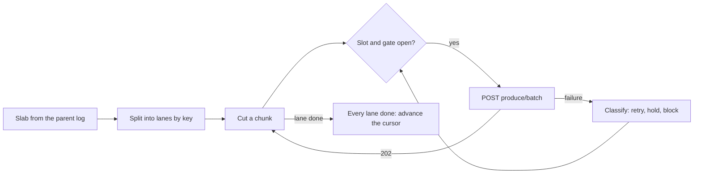

# Remote replication

Learn how a remote child copies a topic to another Narad cluster: the fan-out cursor, the send path, the checks, the stored credentials and the gates every write passes.

**Unreleased:** in master, not in v3.1.0.

!!! abstract "In short"
    - A remote child is an ordinary fan-out child with no partitions and a `remote` field. Its cursors are the [fan-out engine's](fanout-engine.md), with a sender at the end instead of a local commit.
    - The sender splits a slab into lanes by key, sends each lane's records in order through the target's batch produce, and advances the cursor only after the target answered `202` for all of them.
    - Every failure is classified into a state that holds the cursor where it is. Nothing about a remote moves a cursor; only drop-behind loses records, and it is counted.
    - Passwords live in Raft, sealed with AES-256-GCM under a key derived from the cluster secret, and each node decrypts each one once into memory.
    - Remote writes pass three gates: every member applies the new Raft entry types, every member's security posture allows remotes, and the node that takes a password attests an encrypted hop.

## Cursors {#cursors}

A remote child is a child topic record with `partitions: 0` and a `remote` link (the remote's name, the topic there, the target's ID, the start mode, the lane count, the pause state and the skip entries). Because it is a fan-out child, everything in [Fan-out engine](fanout-engine.md) holds for it: one cursor per (parent partition, child) on the node that owns the parent partition, the attach epoch and attach point, the cursor file that travels with a partition move, drop-behind with its loss counter, and the delay gate.

What differs:

- **The start point** can be the parent's consumer frontier (`from: unconsumed`) or its oldest retained offset (`earliest`) instead of its committed high watermark. The leader asks every parent partition's owner for it while it proposes the attach, and it goes into `attach_offsets` as for a local child.
- **The commit.** Where a local child's cursor commits a slab to the child's partitions, a remote child's hands it to the sender, which answers committed, stopped, or read again. Read again means the sender could not keep the slab's records in memory across a wait (below), so the cursor reads the same slab from its unadvanced position later. The cursor remembers, per lane, the last record the target accepted (or an admin skipped) of that slab until it advances past it, so a re-read sends only what is not on the target yet; only a request cut off in flight is sent again, a duplicate and never a gap.
- **The listing.** Each owner reports, with its cursor stats, the cursor's state, the record it is stuck on, the age of its oldest unsent record, its last accepted request and its last successful target check. The children listing folds them into one entry, and a partition whose owner did not report shows `unknown`.

A partition move or a decommission stops the cursor on the old owner like any fan-out cursor: it finishes or abandons its in-flight request, does not advance past what the target has not accepted, and the new owner starts from the cursor file it received with the partition. The old owner's per-partition series disappear as its cursor stops, so a stalled state never pages from a node that no longer runs the partition.

## The send path {#send-path}

- **Lanes.** A slab splits into `lanes` streams: a keyed record by the FNV-32a hash of its key, a keyless one by its parent offset. A key therefore always travels on one lane. A lane sends its records in order, one request at a time, and a slab completes before the next is read, so a key's records never overtake each other between slabs.
- **Chunks.** A request carries up to 1,000 records to a target that takes them, 100 to one that does not (the sender probes once per remote per node and after each credential change, with 101 messages without payloads, which any target refuses without storing anything: one capped at 100 says `too many messages`, one that takes 1,000 names the first empty message), and up to 960 KiB of body. A timeout or a target that cut the upload short halves the lane's byte cap, down to 64 KiB; 20 accepted requests in a row double it back. A record larger than the cap goes alone.
- **Encoding.** Each record goes as `{"key", "payload"}`: a payload that is exactly one JSON value, valid UTF-8, with no surrounding whitespace, goes as it is and is stored byte for byte; anything else goes as base64 with `payload_encoding`. A key that is not valid UTF-8 goes as base64. No partition is sent: the target's partitioner places each record. A raw payload the target refuses is retried once as base64 before the lane blocks on it.
- **Compression.** With the remote's `compression: zstd` and a target that decodes zstd, a chunk that shrinks by at least 10% is sent compressed. A target that answers a compressed chunk with `415` or `invalid json` gets it again uncompressed at once, and compression stays off until the next check.
- **Slots and the gate.** A remote's `max_in_flight` slots are shared by every lane of every cursor that sends to it from one node, and resized live. Each remote also has a gate per node: a remote-wide failure, or three transient failures in a row, closes it, and then one request per backoff (250 ms doubling to 30 s, with jitter) goes through as the probe for every cursor. A dead remote therefore sees one request per interval per node, not one per cursor, and a cursor waits for the gate before it reads its next slab, so a dead remote costs no reads.
- **Held records.** A lane that must wait (the gate, a stall, a pause, a blocked record) copies its unsent records off the parent log into the node's held budget, `remotes.max_held_bytes` (256 MiB by default), first come first served, so a long outage pins no log frames. When the budget cannot take them, the cursor keeps nothing, logs an error, counts `narad_fanout_remote_rereads_total` and reads the slab again after the wait, skipping what the target already has.

## What each answer does {#answers}

| Answer | Action | State |
|---|---|---|
| `202` | The chunk is committed; the next one goes. | `running` |
| `400` with `message N:` | Resend the records before N alone, retry N once as base64 if it went raw, then block the lane on it. | `rejected_record` |
| `400` without an index, or another Narad-shaped `4xx` | Split the chunk in halves down to one record to find the one the target refuses. | `rejected_record` |
| `409` | The target topic became a delay child or a stub: block on the first record and check the target again. | `rejected_record` |
| `413` | Halve the chunk; a single record that still gets it blocks the lane. | `record_too_large` |
| `401` | Close the remote's gate for 30 s. | `auth_failed` |
| `403` | Stall the cursor, retried every 30 s and at once when the remote changes. | `forbidden` |
| Narad's `404` | Stall. | `target_missing` |
| Go's bare `404` from the batch route | Read the target's children listing: a target that answers it has no batch produce (stall); otherwise something in front of it answered. | `no_batch_produce` |
| `3xx` | Stall; redirects are never followed. | `redirect_refused` |
| `429` | Close the gate for the target's `Retry-After`, at most 60 s, whether a chunk or a target check got it. | `throttled` |
| `408`, `5xx`, a timeout, a reset, a non-Narad answer | Retry after the lane's backoff (250 ms to 2 s); the request may have landed, so its records count as resent. | `unavailable` |
| A refused dial | Stall. | `destination_refused` |
| A TLS failure | Close the gate. | `tls_failed` |

Nothing from the target's answer is logged or returned except its status, its class and a message index. A cursor logs `remote child stalled` with the parent, partition, child, remote, state and, when an answer stalled it, that answer's status, once each time it enters a stall, whatever stalled it (an answer, a failed lookup, a target check, a refused record), and `remote child running again` once it sends again. The line is an error for a state that needs a fix and a warning, at most once a minute per cursor, for `unavailable` and `throttled`; a retry that meets the same stall logs nothing. A cursor that blocks on a record also logs `remote child blocked on a record the target refuses` with the offset.

## Target checks {#target-checks}

**At attach, resume and test,** every member of this cluster runs the same checks with its own cached credential, so they exercise exactly what the data path will use, within 15 s each:

1. The member's posture allows remotes, and it holds the remote's current credential version.
2. A TCP and TLS connection through the address guard succeeds, with the chain and the hostname verified. With `remotes.allowed_hosts` set, the connect time is reported, with an estimate of one lane's capacity: 100,000 / (round trip in ms + 5) records per second.
3. The target answers its topic without credentials with `401`, so its security is on.
4. With credentials, the topic exists, is no delay child and no stub, is not the parent itself (same ID), and its schema matches the parent's. The server certificate expiring within 14 days is a warning.
5. None of the topic's children is a remote child (the loop rule).
6. An empty batch produce is answered `400` `messages required`: the credential holds `produce` and the route exists, and nothing is written.
7. The credential cannot list the target's users, so it is not an admin.

The leader folds the members' reports: every member must pass at the remote's credential version and see the same target ID, which the attach records.

**While the link runs,** each cursor checks its target when it starts, every `check_interval_ms` with 20% jitter whether or not it has records to send, after its remote's gate closed and opened again, and before it retries a stall. A check that errors is tried again sooner: after `check_interval_ms` or 30 s, whichever is shorter, beside an open gate (the link's other lanes keep sending meanwhile, and do not wait for the retry), and before every probe while the gate is closed. The runtime check reads the target's children listing: a remote child anywhere on the target topic stops the link (`target_has_remote_children`), and so does a target ID other than the recorded one (`target_replaced`), before anything is sent to it. A link to a target topic created before topic IDs (v2.1 and earlier) records none; an ID the target reports later means the topic was recreated, or the URL reaches another cluster, and stops it the same way. A check is a request like a chunk: it passes the remote's gate and its outcome counts there, so while the gate is closed only the gate's probe goes out, a probe whose check the remote refuses as a whole (`auth_failed`, `throttled`, `tls_failed`) sends no chunk behind it, and a wrong password costs the target one failed login per node per 30 s however many cursors the node runs. A probe whose check fails transiently (unavailable, an edge) still sends its chunk, so a target that takes chunks while its listing fails reopens the gate; the reopen check stays owed, and the link's lanes wait for it before they send more. Beside an open gate a check that errors never stops sending; it counts in `narad_fanout_remote_check_failures_total`, and a running link with no successful check for 10 minutes is flagged `unverified`. A target on a release before remote children (v3.1.0) serves no `parent_id` and no `remote` objects in that listing: it cannot hold a remote child, so no loop runs through it and the attach warns that loop detection starts once it is upgraded; recreate detection then reads the topic's id from `GET /v1/topics/{t}`, which v3.1.0 serves (unreleased).

## Credentials {#credentials}

**Sealing.** The node that receives a password checks it, seals it and drops it; only the ciphertext goes to the leader and into Raft. The key is derived with HKDF-SHA-512 from the cluster secret, a random 32-byte salt that the cluster's first remote create mints, and a fixed purpose label. Each ciphertext (AES-256-GCM, a random nonce per seal) carries the version of the key it was sealed under, and its associated data binds it to the remote's name, ID, canonical URL, username and trust anchor (the SHA-512 of its CA bundle, or the system roots). A changed URL, user or CA without a new password would no longer open, which is why the API asks for the password again. The fingerprint shown in answers is the first 6 bytes of an HMAC-SHA-512 of the remote's ID and password, under a second key derived the same way with its own label, so it reveals nothing without the cluster secret. Each key counts its seals, and refuses past 2^30.

**The cache.** Each node keeps one entry per remote, built once per credential version: the decrypted password turned into a ready `Authorization` value and an HTTP client with its own TLS configuration and connection pool. The send path does no cryptography. The cache rebuilds only when the metastore's remotes version moves (a create, a change, a re-encrypt, a delete, a snapshot restore), and then reuses an entry whose record still matches everything its ciphertext was sealed to; a limits change builds a new client without a decrypt. A deleted remote drops its entry and closes its idle connections. `narad_remote_credential_decrypts_total` moves once per credential version per node.

**Rotation.** `NARAD_CLUSTER_SECRET_PREVIOUS` lets a node derive the previous key too, so it can open ciphertexts sealed before a cluster secret rotation; cluster RPC never accepts it. The re-encrypt on the leader opens each such ciphertext and seals it under the current key as a compare-and-set on its credential version, so a remote changed meanwhile keeps its newer ciphertext.

What this protects and what it does not is the [accepted risk](../operate/remotes.md#accepted-risk).

## The outbound transport {#transport}

- **TLS.** `https` only, HTTP/1.1, TLS 1.2 or later with the key exchanges X25519MLKEM768 and X25519. Verification is always on, against the remote's CA bundle alone when it has one, else the system roots; the server name comes from the URL.
- **No proxy.** `HTTP_PROXY` and `HTTPS_PROXY` are ignored, so a credential never transits a proxy nobody configured for it.
- **No redirects.** A `3xx` comes back as `redirect_refused`, so the `Authorization` header never reaches a `Location` host.
- **The address guard.** The URL's port must be in `remotes.allowed_ports`, and its host in `remotes.allowed_hosts` when that is set (exact names and `*.suffix` patterns, matched on the canonical host), at create and on every dial. Every dial is checked again after DNS resolution, in the dialer's control hook, so DNS rebinding cannot route around it: loopback, link-local, multicast, broadcast and cloud metadata addresses (`169.254.0.0/16`, `fd00:ec2::/32` and the other providers' metadata addresses), and their IPv4-mapped and NAT64 spellings, are refused (`destination_refused`) unless `remotes.allow_addresses` lists them. Private ranges stay reachable: a remote is normally a first-party cluster on a private network.

## Writes and their gates {#gates}

Every remote write and remote child write is validated on the node that took it, which then sends it to the Raft leader in the `RemoteWrite` node RPC op with the caller's name and a request ID; the leader checks again, proposes one Raft entry and writes the authoritative audit line. Three gates stand in front of a write:

- **The release gate.** The remote Raft entry types (33 to 37) are proposed only once every member, dead ones and Raft servers without a member record included, reports a release that applies them, from the member records ([Raft entry types](metastore-and-raft.md#remote-entry-types)). Until then every remote write is refused with `412` naming the member; none is written another way. The ingress checks it from its replica before it seals anything, and the leader again before it proposes.
- **The posture gate.** A create, change, re-encrypt, attach and resume also ask every member, in the `RemoteCheck` op, for its posture: security on and legacy cluster authentication off, since the legacy token is replayable and would let a forged `RemoteWrite` through. A member that does not answer holds them back. Raft TLS is reported, not required; a node that holds remotes over plaintext Raft warns. Pause, skip and a remote delete run the release gate alone, so they work with a member down.
- **The hop gate.** A create or a password change carries a password in its body, so the node that takes it refuses (`412`) unless `remotes.api_hop_encrypted` attests that the hop from the ingress to that pod is encrypted.

Deletes take the same route only when they involve a remote child: a node sends a delete or detach that its replica shows as remote-linked as a `RemoteWrite`, so the leader can run the [unshipped check](#unshipped-check) before the topic manager deletes. Any other delete keeps the plain path, and a leader that finds a remote child where the sender saw none refuses the plain delete with `409` (retry), so a delete can never skip the check. A leader on an older release answers `RemoteWrite` as an unknown op, which the node turns into `412`.

## The unshipped check {#unshipped-check}

Before a remote child, or a parent that has one, is deleted, the leader proves nothing is unshipped. It reads in a fixed order: first every member's ingress backlog of the parent (the records it answered `202` for and has not committed, scanned for each check), then every owner's cursor lag. A record leaves a backlog only after it is committed to the parent, and is under the high watermark from then on, so a record dispatched during the check is counted by the lag read that follows; in the other order it could fall between the two reads. A member reads at most 1,000,000 backlog records of any topic for one check and gives up after 12 seconds, so its incomplete answer reaches the leader before the leader stops waiting at 15; it runs one scan per topic at a time and at most two at once. Any lag, any backlog, an owner or member that did not answer, or a backlog the member could not read to the end refuses the delete with `409` and the counts.

Checks for one parent run one at a time, and a new one at most every 10 seconds (`429` between). A delete that arrives while a check runs waits for it, and shares its answer only if that check started after the delete arrived; otherwise it waits for the next one, because a check already under way may have scanned a backlog before a record the delete must count was accepted.

## Remote replication constants {#constants}

| Thing | Value |
|---|---|
| Records per request | 1,000 to a target that takes them (probed), else 100 |
| Request body cap per lane | 960 KiB, halved to a 64 KiB floor, doubled back after 20 accepted requests |
| Slab per lane | 500 records or 1 MiB |
| Lane backoff for one transient failure | 250 ms to 2 s, full jitter |
| Gate backoff | 250 ms to 30 s, full jitter; trips after 3 transient failures in a row; 30 s for `auth_failed`; up to 60 s of `Retry-After` |
| Stall retry | 30 s, or at once when the remote changes |
| Held records per node | `remotes.max_held_bytes`, 256 MiB |
| Compression threshold | 10% saved |
| Target check | 15 s per member; every `check_interval_ms` (60 s) with 20% jitter at run time, an errored one again after at most 30 s; `unverified` after 10 minutes |
| Checks of one remote per node | 1 every 5 s |
| Unshipped checks per parent | 1 every 10 s |
| Remote writes per node | 10 a minute (remotes), 60 a minute (remote children) |
| Remotes per cluster / remote children per parent | 64 / 16 |
| Parent retention floor / attach warning | 24 h / 72 h |
| Key derivation / cipher | HKDF-SHA-512 with a 32-byte per-cluster salt / AES-256-GCM |
| Seals per key | 2^30 |

## Next steps

- [Fan-out engine](fanout-engine.md): the cursors a remote child shares with local children.
- [Networking and security](networking-and-security.md#outbound): the outbound plane among the others.
- [Manage remotes](../operate/remotes.md): what an operator does with all this.
